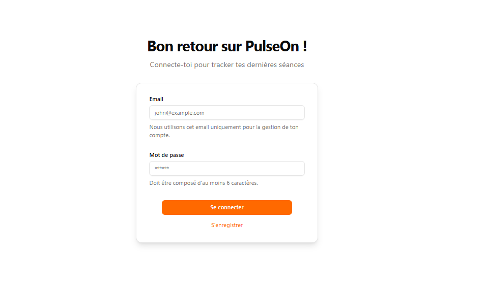
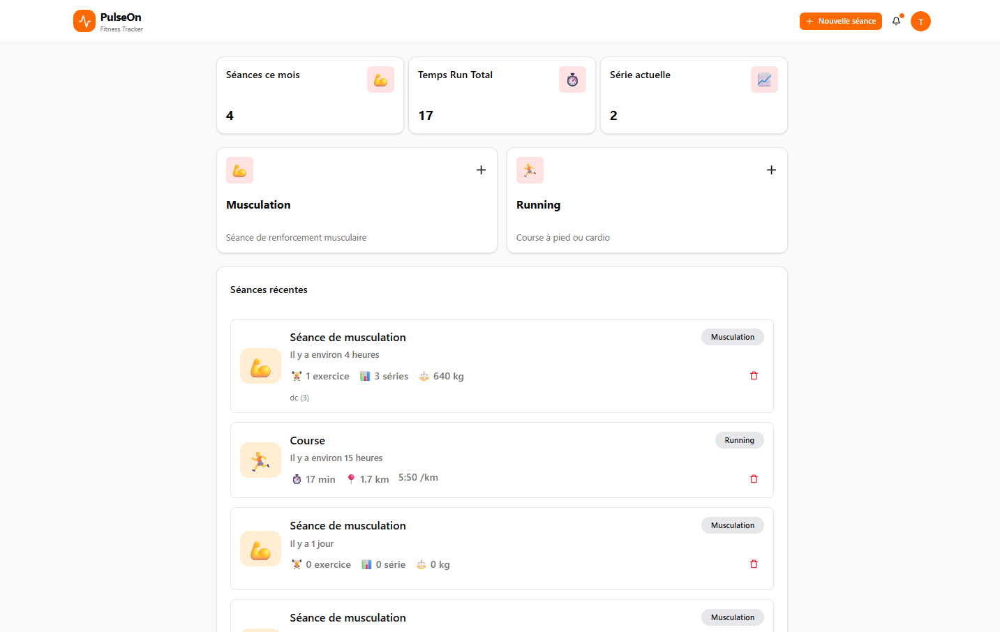
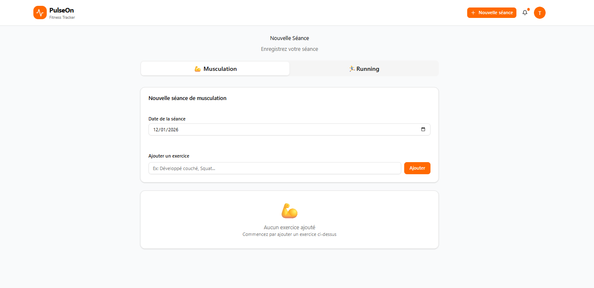

# PulseOn

Currently in development🏗️

Web application for tracking and analyzing your sport sessions(running and strength training).

## Technologies Used
- Frontend: React, TypeScript, Tailwind CSS, React Hook Form, Zod, Apollo Client
- Backend: Node.js, Express, TypeScript, GraphQL, TypeOrm, PostgreSQL & Adminer to manage the database, Apollo Server
- Authentication: JWT
- Deployment: Docker, Docker Compose
- Testing: Vitest









## 📁 Project Structure

```
PulseOn/
├── backend/              # GraphQL API server
│   ├── src/
│   │   ├── entities/    # TypeORM entities
│   │   ├── resolvers/   # GraphQL resolvers
│   │   ├── inputs/      # Input types
│   │   └── config/      # Configuration files
│   └── Dockerfile
├── frontend/            # React application
│   ├── src/
│   │   ├── components/  # React components
│   │   ├── pages/       # Page components
│   │   ├── graphql/     # GraphQL queries/mutations
│   │   └── generated/   # Generated GraphQL types
│   └── Dockerfile
├── docker-compose.yml   # Docker orchestration
└── nginx.conf          # Nginx reverse proxy config
```


